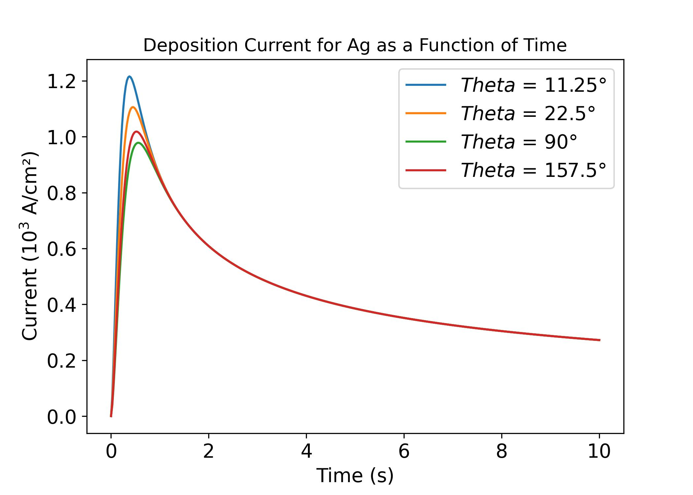

# Theoretical Current Transients during Electrocrystallization
 Diffusion Current Transients from Spherical Cap Theory During Electrocrystallization

## Evans' Theory for Electrocrystallization

Evans' theory describes the current transient behavior during metal electrodeposition, considering the influence of nucleation rate and diffusion-controlled growth. The number of nucleation sites follows an exponential activation law, while the active surface area expands with a diffusion-limited radius. The transient current follows:

$$I(t) = I_0 (1 - e^{-At}) t^{1/2}$$

where ($I_0$) is a material-dependent prefactor. This theory is particularly useful for analyzing electrochemical deposition processes in metals like **silver (Ag), lithium (Li), and magnesium (Mg)**. The model predicts an initial increase in current due to growing nucleation sites, followed by a decay as diffusion dominates.

## Avrami Theory for Electrocrystallization

The **Avrami theory** models the **time-dependent surface coverage** during electrocrystallization, considering **nucleation rate**, **growth kinetics**, and **diffusion overlap**. The fraction of the electrode covered by diffusion zones is:

$$ S = 1 - \exp(-b d(\theta) \Theta(At) t) $$

where:
- \( b \) depends on nucleation site density,
- \( d(\theta) \) accounts for contact angle effects.

The current density follows:

$$ I(t) = \frac{a}{t^{1/2}} \left[1 - \exp(-b d(\theta) \Theta(At) t) \right] $$

This reflects **diffusion-limited growth** of nuclei.

### **Comparison with Evans Theory**
- **Avrami**: Nucleation + Growth, considers surface coverage evolution.
- **Evans**: Diffusion-controlled deposition, no explicit nucleation model.

## Avrami–Evans–Kolmogorov (AEK) Theorem in Electrocrystallization

The Avrami–Evans–Kolmogorov (AEK) theorem extends the classical Avrami and Kolmogorov phase transformation theories to electrocrystallization by incorporating diffusion effects (Evans’ contribution). This framework is particularly useful for describing the time-dependent nucleation and growth of metal deposits on an electrode surface.

Key aspects of the AEK theorem in electrocrystallization:
1.	Surface Coverage ( S ): Describes the fraction of the electrode covered by growing nuclei, incorporating nucleation, growth, and diffusion:

$$
S = 1 - \exp(-b d(\theta) \Theta(At) t)
$$

where:

- $b$ depends on the nucleation site density ( $N_0$ ) and diffusion coefficient ( $D$ ),
- $d(\theta)$  is a shape factor accounting for the effect of contact angle,
- $\Theta(At)$  accounts for the transient nucleation dynamics.

2.	Current Density ( I ): The electrochemical current transient follows:

$$
I(t) = \frac{a}{t^{1/2}} \left[1 - \exp(-b d(\theta) \Theta(At) t) \right]
$$

where $a = \frac{n F D^{1/2} c}{\pi^{1/2}}$ is a prefactor influenced by the charge transfer rate and ion diffusion properties.

###

# (AEK) Theorem in Electrocrystallization

The **(AEK) Key Equations** in a nutshell:

#### **Surface Coverage**
$$ S = 1 - \exp(-b d(\theta) \Theta(At) t) $$

#### **Current Density**
$$ I(t) = \frac{a}{t^{1/2}} \left[1 - \exp(-b d(\theta) \Theta(At) t) \right] $$

where:
- ($b$) is a parameter influenced by nucleation site density and diffusion coefficient,
- ($d(\theta)$) is a shape factor that accounts for contact angle effects,
- ($\Theta(At)$) represents transient nucleation kinetics,
- ($a = \frac{n F D^{1/2} c}{\pi^{1/2}}$) is the prefactor controlling mass transport.

### **Key Features**
- **Incorporates Diffusion Effects (Evans’ Contribution)**  
- **Accounts for Surface Coverage Evolution (Avrami–Kolmogorov)**  
- **Applies to Electrochemical Deposition (e.g., Ag, Li, Mg deposition)**  

### **Comparison with Individual Theories**
| Theory | Description | Surface Coverage | Diffusion Effects |
|--------|------------|------------------|-------------------|
| **Kolmogorov** | Random nucleation model | No explicit diffusion | No |
| **Avrami** | Nucleation + Growth | Includes surface coverage | No |
| **Evans** | Diffusion-limited deposition | No nucleation model | Yes |
| **AEK** | Combines all three for electrocrystallization | Yes | Yes |

--- 

Contact Info:

 - Email: attari.v@tamu.edu
 - Department of Materials Science and Engineering